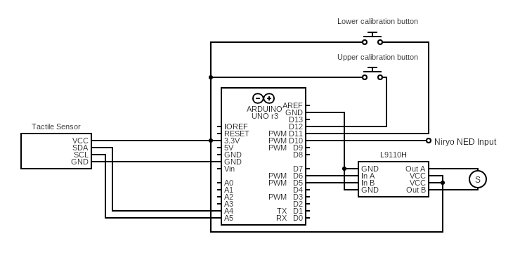

# tactile-control
Arduino based control system for soft robotic gripper using tactile sensors.

Developed for Master Thesis at Queen Mary University of London, August 2023

## Setup for Arduino
Set up Arduino UNO, sensors, and ICs as shown in the circuit diagram below.

Open `tactile_control.ino` file within Arduino IDE.

This will also open all `.h` and `.cpp` files in the `./tactile_control` directory.

Ensure the Arduino board is connected via USB and the proper port is selected in the IDE.

Run the code

##Gripper Behaviour
--

## NED Test cases
These test cases are desinged to be run using a Niryo NED robotic gripper. A description of each test is given below.

To run a test case simply uload the desired `.xml` to the NED and start it using the Niryo IDE.

### Test Case 1
1. Arm at rest in gripping position
2. Gripper engages
3. Arm raises vertically
4. Arm remais elevated for 15 seconds
5. Arm lowers and gripper disengages

### Test Case 2
1. Arm at rest in gripping position
2. Gripper engages
3. Arm raises vartically and rotates gripper to point parallel to ground plane
4. Gripper rotate from $-90^\circ$ through to $90^\circ$ around central gripper axis
5. Arm returns to start position and gripper disengages

### Test Case 3
--
