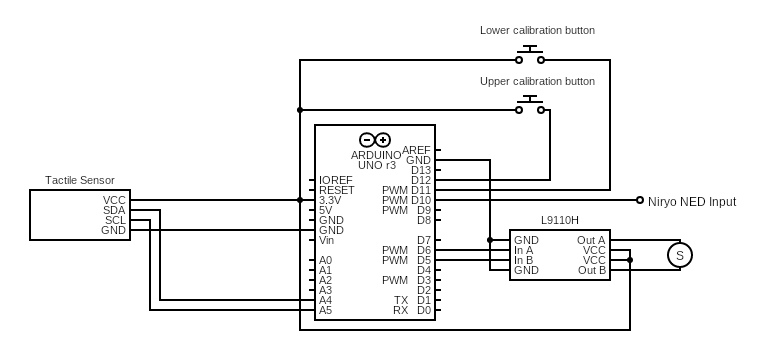

# tactile-control
Arduino based control system for soft robotic gripper using tactile sensors.

Developed for Master Thesis at Queen Mary University of London, August 2023

## Setup for Arduino
Set up Arduino UNO, sensors, and ICs as shown in the circuit diagram below.

[INSERT CIRCUIT DIAGRAM]

## NED Test cases
These test cases are desinged to be run using a Niryo NED robotic gripper. A description of each test is given below.

To run a test case simply uload the desired .XML to the NED using the Niryo IDE.

### Test Case 1
--

### Test Case 2
